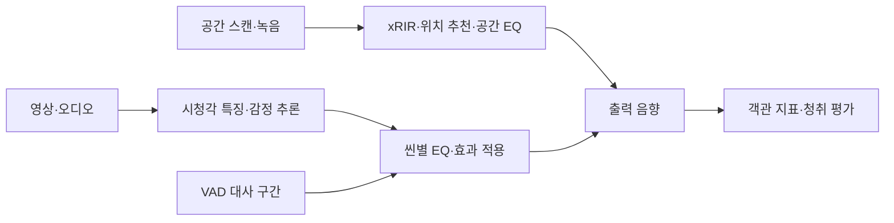

# POFLIX | 공간·장면 기반 홈 시네마 음향 최적화

 [](LICENSE)

방의 음향 특성과 영상 장면의 감정을 함께 고려해 사운드를 보정하는 **AI 음향 처리 프로토타입**입니다. 공간 인식(xRIR)과 콘텐츠 인식(Mood-EQ)을 구현하고, 감정 회귀 성능·오디오 품질·청취 선호를 각각 평가했습니다.

> 포스코 청년 AI·Big Data 아카데미 32기 최우수상 — AI 부문, 5인 팀 프로젝트

## 프로젝트 한눈에 보기

| 항목 | 내용 |
|---|---|
| 해결하려는 문제 | 공간 보정과 장면별 음향 조절을 어떻게 연결하고, 대사 보호와 감정 표현을 함께 평가할 것인가? |
| 진행 기간 | 2026.03.30–2026.04.29 |
| 데이터 | AcousticRooms 공간 음향 · LIRIS-ACCEDE 감정 학습 · COGNIMUSE 200클립 별도 평가 |
| 접근 | 시청각 특징 융합 · Valence/Arousal 회귀 · 7개 mood 분류 · Dual-Layer EQ · VAD 대사 보호 |
| 도구 | Python · PyTorch · FastAPI · React Native · Pedalboard · librosa |
| 본인 역할 | Mood-EQ 모델링·추론 워커·성능 평가·발표 자료 구성, 팀 기여도 25% |
| 산출물 | [팀 발표자료](docs/POFLIX_발표자료.pdf) · [시스템 구성](docs/system-overview.md) · 모델·음향 처리·평가 코드 |
| 공개 실행 범위 | 소스와 설계 기록. 외부 데이터, 최종 학습 체크포인트, 평가 영상·음원은 별도 확보 필요 |

## 핵심 결과와 해석

| 평가 | 기록된 결과 | 해석 범위 |
|---|---|---|
| 공간 인식 백본 | ConvNeXT C50 error `1.0827`, p-value `0.0085` | 해당 실험의 백본 선택 근거. 다른 참조 RIR 수의 논문 결과와 직접 순위 비교하지 않음 |
| 감정 회귀 | LIRIS-ACCEDE mean CCC `0.3603` (V `0.3895`, A `0.3312`) | 감정 회귀 성능이며 오디오 선호율과 다른 지표 |
| 별도 데이터셋 | COGNIMUSE 200클립 mean CCC `0.3781` | 평가셋·라벨 분포가 달라 일반화 향상이나 과적합 부재를 단정하지 않음 |
| 블라인드 청취 | 40명 중 32명, `80%`가 적용본 선택 | 참여자 표본의 선호 결과. 시장 수용성이나 모든 영상의 개선을 입증하지 않음 |
| 실측 공간 3곳 | 기록된 추론 시간 `3.3–5.8초` | 해당 환경의 관측값. 모바일 온디바이스 성능은 별도 검증 필요 |

수치는 팀 발표·실험 기록에서 정리했습니다. 이번 저장소 검토에서 학습이나 청취 평가를 다시 수행한 결과는 아닙니다. 평가 조건·ablation·한계는 [상세 기록](docs/PROJECT_DETAILS.md)에 보존했습니다.

## 시스템 흐름과 담당 작업



본인은 콘텐츠 인식 트랙에서 감정 추론을 EQ로 연결하는 워커, 씬 라벨 검수, A/B 청취 평가 도구와 객관 지표 평가를 담당했습니다. 대사 활성 구간의 효과 강도를 줄이고, 감정 회귀와 출력 음향 품질을 구분해 평가했습니다.

## 주요 문서와 파일 구조

| 경로 | 역할 |
|---|---|
| `backend/`, `mobile/` | FastAPI 서버와 스캔·녹음·UI 앱 |
| `model/`, `run_pipeline.py` | 모델·음향 처리 및 입력 영상 → 타임라인 → EQ·효과 적용 |
| `scripts/`, `tools/` | 특징 추출·ablation·데모 생성·객관 지표 측정 |
| `evaluation/` | 청취 평가 UI·씬 라벨·평가 절차 |
| `docs/` | 발표자료·설계·운영 가이드·버전별 의사결정 |

- [상세 실험 기록](docs/PROJECT_DETAILS.md) · [팀 발표자료](docs/POFLIX_발표자료.pdf)
- [시스템 구성](docs/system-overview.md) · [Dual-Layer EQ와 대사 보호](docs/audio-features.md)
- [워커 운영 가이드](docs/worker-guide.md) · [버전별 의사결정](docs/decisions/)
- [V3.3 초기 명세](docs/specification.md) · [LIRIS 전환 계획](docs/liris-migration-plan.md)
- [외부 모델·데이터 출처와 이용 조건](docs/THIRD_PARTY.md)

V3.3은 초기 CCMovies 기반 기록입니다. 최종 LIRIS 기반 K=7 구성은 전환 문서와 버전별 기록을 함께 확인합니다.

## 실행 조건과 확인 방법

Python 가상환경과 FFmpeg가 필요합니다. 루트 의존성은 콘텐츠 처리 환경이며 백엔드·학습·pseudo-label 환경에는 각 폴더의 의존성도 필요합니다. 외부 백본·최종 체크포인트 없이 전체 추론을 즉시 재현할 수 있는 구성은 아닙니다.

```bash
python -m venv .venv
# macOS/Linux: source .venv/bin/activate
# Windows PowerShell: .\.venv\Scripts\Activate.ps1
pip install -r requirements.txt
python run_pipeline.py --help

# 사용 권한이 있는 영상과 liris_base/K=7 호환 체크포인트 확보 후
python run_pipeline.py --video path/to/video.mp4 --ckpt path/to/best.pt
```

`--ckpt`에는 여러 체크포인트를 넘길 수 있습니다. 기본 3개 경로는 `runs/phase2a/2a2_A_K7_s{42,123,2024}/best.pt`이며 저장소에 포함되어 있지 않습니다.

객관 지표는 음량을 맞춘 기준·처리 음원과 분리한 대사 음원이 필요합니다.

```bash
python tools/objective_metrics.py --ref path/to/reference.wav --test path/to/processed.wav --vocals path/to/vocals.wav
```

`tools/run_v3_5_7_pipeline.py --job topgun`은 기존 평가 작업의 타임라인·stem·음량 일치 파일을 사용하는 도구입니다. 새 영상의 기본 진입점과 구분합니다.

## 한계와 후속 검증

- 시뮬레이션과 실제 주거 환경의 차이가 남아 있습니다. 실측 3곳만으로 일반적인 안정성을 주장하지 않습니다.
- 참조 RIR 수가 다른 논문 수치는 참고값입니다. 동일 조건의 비교가 필요합니다.
- CCC와 청취 선호는 다른 평가 대상입니다. 유의하지 않은 p-value가 효과의 동등성을 뜻하지 않습니다.
- 청취 표본·영상·환경을 확대하고 반복 평가와 불확실성 보고를 보완해야 합니다.
- 씬 단위 처리와 백엔드 추론 구조입니다. 프레임 단위 실시간·온디바이스 통합은 후속 과제입니다.

## 프로젝트 정보

아카데미 32기 C4의 5인 팀 프로젝트입니다. [MIT License](LICENSE)는 자체 코드 기준이며 외부 모델·데이터의 이용 조건은 별도입니다.

최진원 · [GitHub](https://github.com/jinwon25)
